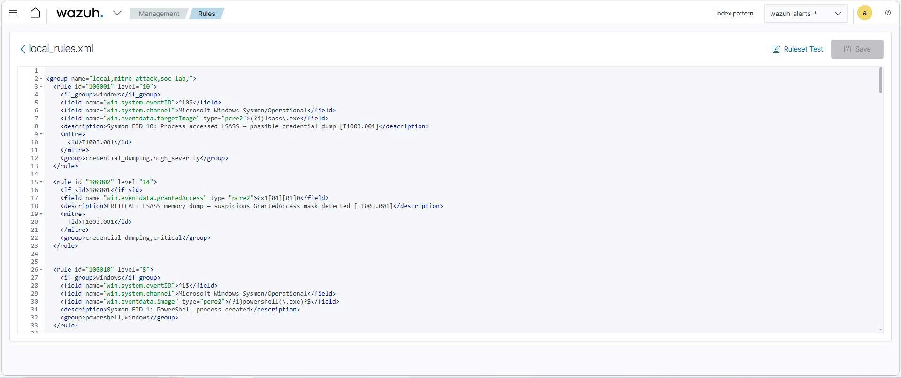
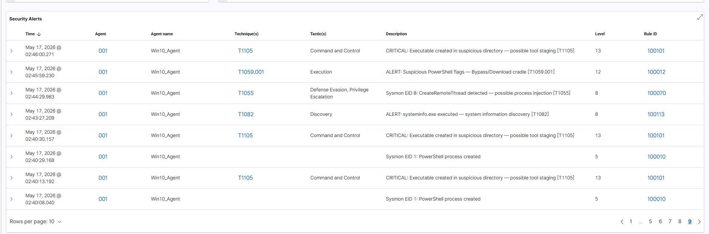
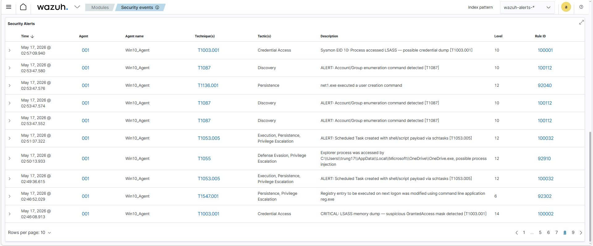
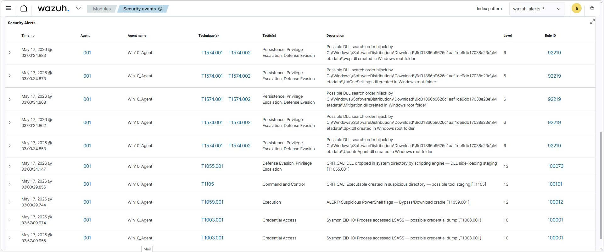
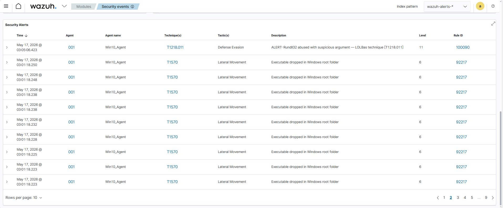
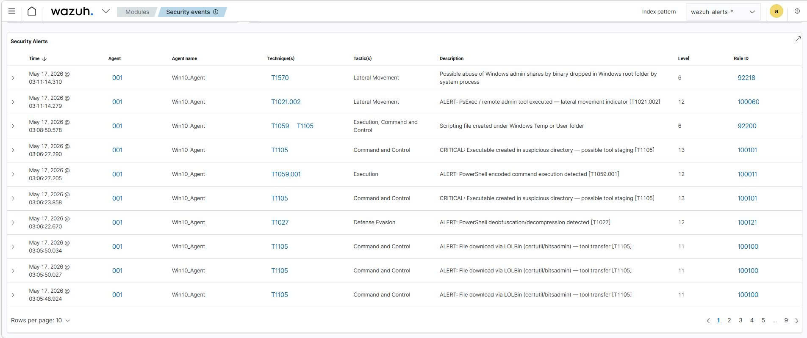
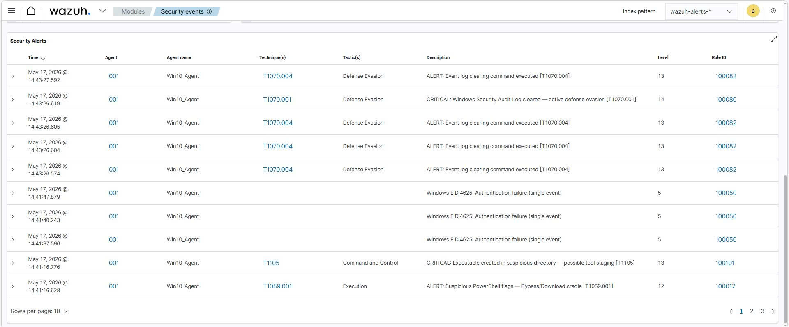

# Phase 1: Lắng nghe, Giám sát và Phát hiện Mối đe dọa

Thiết lập nền tảng giám sát từ thu thập Telemetry trên Endpoint đến phân tích, phát hiện và quản lý cảnh báo theo khung MITRE ATT&CK.

Giai đoạn này triển khai kiến trúc SIEM với bộ Detection Rules tùy chỉnh. Tại đây, mọi sự kiện, luồng mạng và hành vi trên máy trạm sẽ được tổng hợp, phân tích dựa trên các luật cảnh báo để chỉ mặt đặt tên các rủi ro bảo mật trước khi chúng gây hại lớn hơn.


## Công cụ sử dụng

- **Wazuh**: Đóng vai trò thu thập và phân tích. Thu nhận log, chạy đối chiếu với rule và đánh giá các hành vi bất thường.

- **Sysmon**: Đóng vai trò giám sát sâu trên Windows. Theo dõi mọi hành động khởi tạo tiến trình, chỉnh sửa Registry hay kết nối mạng và báo cáo lại với độ chi tiết vượt trội so với Windows Event Log mặc định.

- **Atomic Red Team**: Bộ công cụ kiểm thử mã nguồn mở ánh xạ trực tiếp với khung MITRE ATT&CK. Dùng để giả lập các kỹ thuật tấn công thực tế trên máy trạm Windows mục tiêu nhằm xác thực khả năng phát hiện của hệ thống.


## Luồng hoạt động

- **Telemetry Collection**: Sysmon và Windows Event Logs túc trực trên Windows Endpoint ghi nhận từng hành vi nhỏ nhất. Trình Wazuh Agent liên tục đóng gói các sự kiện này và đẩy về máy chủ Wazuh trung tâm.

- **Attack Simulation**: Atomic Red Team thực thi các kịch bản tấn công được lập trình sẵn theo từng Technique ID của MITRE ATT&CK. Đây là bước tạo ra sự kiện để xây dựng và kiểm thử Detection Rules.

- **Analysis & Detection**: Wazuh Manager tiếp nhận và bắt đầu bóc tách, chuẩn hóa dữ liệu log. Hệ thống đối chiếu với bộ luật tùy chỉnh. Nếu một tiến trình thỏa mãn điều kiện nghi ngờ, hệ thống lập tức kích hoạt cảnh báo.

- **Alerting**: Cảnh báo được ghi nhận trên Wazuh Dashboard kèm chi tiết đầy đủ về Rule ID, mức độ nghiêm trọng, thông tin máy trạm bị ảnh hưởng và ánh xạ MITRE ATT&CK. Đây là đầu ra của Phase 1, sẵn sàng chuyển tiếp sang Phase 2 qua Webhook.


## Quy trình thực hiện

1. Giả lập tấn công bằng Atomic Red Team trên máy Windows mục tiêu.

| MITRE ID | Tên kỹ thuật | Công cụ giả lập | Rule ID | 
|---|---|---|---|
| T1003.001 | OS Credential Dumping: LSASS Memory | Atomic Red Team | 100001–100002 | 
| T1059.001 | PowerShell Encoded / Bypass Execution | Atomic Red Team | 100010–100012 | 
| T1547.001 | Registry Run Keys / Startup Folder | Atomic Red Team | 100020–100021 |
| T1053.005 | Scheduled Task — Shell Payload | Atomic Red Team | 100030–100032 | 
| T1136.001 | Create Local Admin Account | Atomic Red Team | 100040–100041 | 
| T1110.001 | Brute Force Password Guessing | Script | 100050–100053 | 
| T1021.002 | Lateral Movement via SMB / PsExec | PsExec | 100060–100061 | 
| T1055.001 | Process Injection — DLL Injection | Atomic Red Team | 100070–100073 | 
| T1070.001 | Indicator Removal: Clear Event Logs | Atomic Red Team | 100080–100082 | 
| T1218.011 | LOLBas: Rundll32 Abuse | Atomic Red Team | 100090–100091 | 
| T1105 | Ingress Tool Transfer (certutil/bitsadmin) | Atomic Red Team | 100100–100101 | 
| T1082 | System Information Discovery / Recon | Atomic Red Team | 100110–100114 | 
| T1027 | Obfuscated Files / Payload Deobfuscation | Atomic Red Team | 100120–100122 |

2. Quan sát log thô đổ về Wazuh Dashboard 
3. Viết Detection Rule vào [local_rules.xml](./local_rules.xml) chứa toàn bộ 36 Detection Rules (Rule ID `100001`–`100122`) ánh xạ trực tiếp với 13 kỹ thuật tấn công theo khung MITRE ATT&CK. 

4. Kiểm thử lại bằng cách tái giả lập tấn công 
```
Invoke-AtomicTest T1082 -TestNumbers 1
Invoke-AtomicTest T1059.001 -TestNumbers 1 
Invoke-AtomicTest T1547.001 -TestNumbers 1
Invoke-AtomicTest T1053.005 -TestNumbers 1
Invoke-AtomicTest T1136.001 -TestNumbers 8
Invoke-AtomicTest T1003.001 -TestNumbers 1
Invoke-AtomicTest T1055.001 -TestNumbers 2 
Invoke-AtomicTest T1218.011 -TestNumbers 1
Invoke-AtomicTest T1105 -TestNumbers 7 
Invoke-AtomicTest T1027 -TestNumbers 2 
1..10 | ForEach-Object { net use \\127.0.0.1\IPC$ /user:fakeuser "WrongPass$_" 2>$null; Start-Sleep -Milliseconds 500 }
& "$env:TEMP\PsExec.exe" -accepteula \\127.0.0.1 cmd.exe /c "whoami"
Invoke-AtomicTest T1070.001 -TestNumbers 1
```
5. Xác nhận cảnh báo được kích hoạt đúng.







## Kết quả đạt được

- Dựng xong hệ thống SIEM với Wazuh, thu log từ Sysmon, Windows Security và Windows System trên máy Windows mục tiêu.
- Viết 36 Detection Rules trong `local_rules.xml` (ID `100001`–`100122`), detect được 13 kỹ thuật MITRE ATT&CK — từ credential dump, persistence, brute force cho đến lateral movement và defense evasion.
- Có rule match đơn lẻ, có rule dùng `frequency`/`timeframe` để bắt brute force (5 lần fail trong 60s), và có rule chain `if_sid` để theo dõi process cha-con.
- Log chạy từ Endpoint qua Sysmon → Wazuh Agent → Wazuh Manager → Dashboard, alert tự phân theo mức nghiêm trọng (Level 5–15).
