# Phase 2: SOC Automation & Triage tự động 

 Phase 2 nâng cấp hệ thống lên cấp độ chủ động phản ứng. Toàn bộ hạ tầng (Wazuh Manager, TheHive) đã được dựng sẵn ở Phase 1 thì Phase 2 tập trung vào việc kết nối và tự động hóa chúng lại với nhau thông qua Shuffle.

---

## Công cụ sử dụng

- **Shuffle**: Bộ não điều phối tự động mã nguồn mở. Nhận Webhook từ Wazuh, xử lý logic, gọi API bên ngoài và phân phối hành động đến TheHive + Email.

- **VirusTotal API**: Dịch vụ kiểm tra file/hash. Shuffle tự động gọi API này để enrich cảnh báo ngay khi nhận được từ Wazuh để không cần analyst làm thủ công.

- **TheHive**: Nhận Case được tạo tự động từ Shuffle, kèm đầy đủ kết quả Enrichment phục vụ sẵn sàng cho đội SOC điều tra.

- **Email**: Shuffle gửi email thông báo cho SOC Analyst khi có cảnh báo cần can thiệp. Analyst truy cập form phê duyệt trên Shuffle, chọn Continue (block IP) hoặc Stop. Nếu chọn Continue → Wazuh Active Response tự động block IP nguồn tấn công.


---

##  Luồng Tự động hóa


```
[1] Wazuh_alerts (Webhook Trigger)
     │
     ▼
[2] Extract_Hash (Shuffle Tools — regex_capture_group)
     │  Trích xuất SHA256 
     │
     ├── [hash ≠ empty] ──► [3A] VT_Hash_Lookup ──► [4A] Format_VT_Score ──┐
     ├── [hash empty + IP] ► [3B] VT_IP_Lookup  ──► [4B] Format_IP_Score ──┤
     └── [hash empty,no IP]► [3C] Behavioral_Skip_VT ──────────────────────┘
                                                                            │
                                                                            ▼
                                                    [5] Dynamic_Severity_Scoring
                                                         (Execute Python)
                                                                            │
                                                                            ▼
                                                        [6] Convert_Date
                                                         (Execute Python)
                                                                            │
                                                                            ▼
                                                          [7] The_Hive
                                                         (Create Alert)
                                                                            │
                                                                            ▼
                                                        [8] Get_Exec_ID
                                                         (Execute Python)
                                                                            │
                                                                [send_email = true]
                                                                            │
                                                                            ▼
                                                          [9] Email_App
                                                         (SMTP Notification)
                                                                            │
                                                                            ▼
                                                      [10] Email_User_Input
                                                         (Approval Form)
                                                                            │
                                                          [user approved + IP public tồn tại]
                                                                            │
                                                                            ▼
                                                      [11] Get_Wazuh_Token
                                                         (HTTP — POST)
                                                                            │
                                                                            ▼
                                                    [12] Wazuh_Active_Response
                                                         (HTTP — PUT)
                                                      → netsh block IP
```


## Triển khai

### Cài đặt Shuffle SOAR 

- Cài Shuffle self-hosted trên Ubuntu Server để kết nối đến IP private `192.168.56.x` của mạng nội bộ 


- Truy cập giao diện Shuffle từ trình duyệt trên máy Windows:
`http://192.168.56.10:3001`

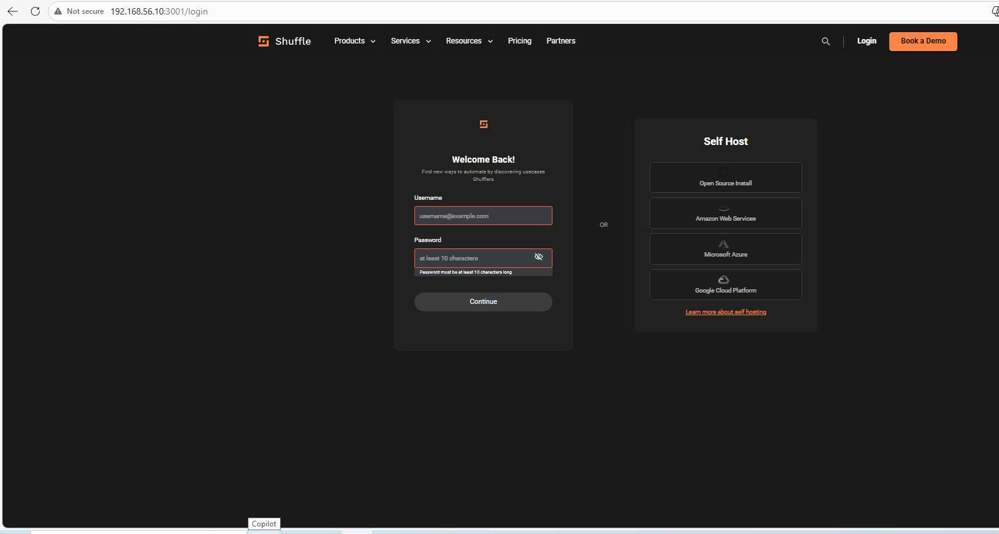

---

### Kết nối Wazuh → Shuffle 

Thêm khối `<integration>` vào file `/var/ossec/etc/ossec.conf` trên Wazuh Manager. Chỉ gửi các alert có level từ 8 trở lên để tránh noise:

```xml
<integration>
  <name>shuffle</name>
  <hook_url>http://192.168.56.10:3001/api/v1/hooks/<SHUFFLE_WEBHOOK_ID></hook_url>
  <level>8</level>
  <alert_format>json</alert_format>
</integration>
```


---

### Xây dựng Workflow trong Shuffle

Luồng gồm 15 node (13 action + 2 trigger) để tự động phân loại dữ liệu alert và chọn đúng API VirusTotal để gọi:

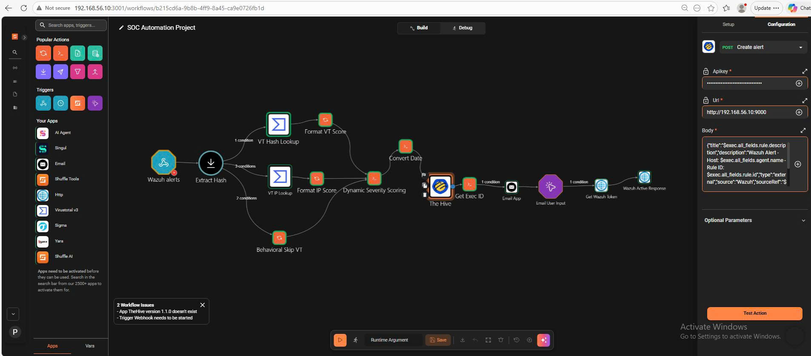

---

**Node 1 — Wazuh_alerts**  
Điểm đầu vào nhận dữ liệu từ Wazuh. 

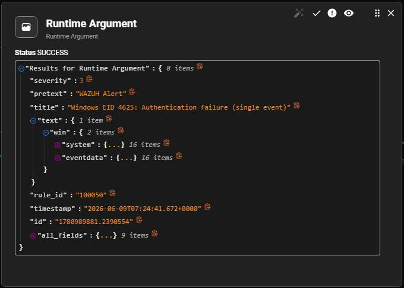

---

**Node 2 — Extract Hash**  
Dùng Shuffle Tools, hành động regex_capture_group để trích xuất SHA256 từ chuỗi Hashes của Sysmon. 

Cấu hình:
- Input data: `$exec.all_fields.data.win.eventdata.hashes`
- Regex: `SHA256=([A-Fa-f0-9]{64})`


---

**Rẽ nhánh dựa trên Extract_Hash**  

**Branch → VT_Hash_Lookup (Nhánh A — File Hash):**
```
Condition: $extract_hash IS NOT EMPTY
```


**Branch → VT_IP_Lookup (Nhánh B — IP Reputation):**
```
Condition: $extract_hash IS EMPTY
       AND $exec.all_fields.data.win.eventdata.ipAddress IS NOT EMPTY
       AND $exec.all_fields.data.win.eventdata.ipAddress DOES NOT MATCH "^(127\.|10\.|192\.168\.|172\.(1[6-9]|2[0-9]|3[01])\.|::1|[fF][eE]80)"
```


**Branch → Behavioral_Skip_VT (Nhánh C — Behavioral):**
```
Condition: $extract_hash IS EMPTY
       AND ($exec.all_fields.data.win.eventdata.ipAddress MATCH ^(127\.|10\.|192\.168\.|172\.(1[6-9]|2[0-9]|3[01])\.|::1|[fF][eE]80|$|.*ipAddress.*))
```

---

**Node 3A — VT_Hash_Lookup**  
Gọi VirusTotal API để kiểm tra danh tiếng của file dựa trên mã SHA256:
- App: `Virustotal_v3`
- Action: `Get a hash report`
- Hash: `$extract_hash`
- API Key
---

**Node 4A — Format_VT_Score**  
Dùng `repeat_back_to_me` để format kết quả VT thành chuỗi dễ đọc:
```
$vt_hash_lookup.#.body.data.attributes.last_analysis_stats.malicious/
$vt_hash_lookup.#.body.data.attributes.last_analysis_stats.undetected engines detected
```
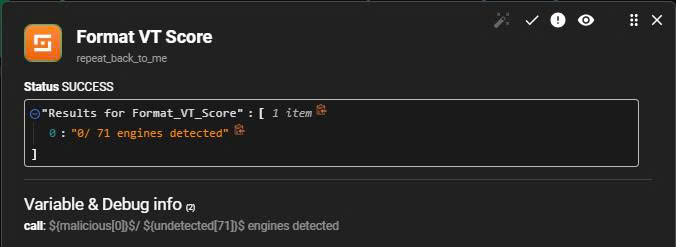
---

**Node 3B — VT_IP_Lookup**  
Kiểm tra danh tiếng IP nguồn tấn công trên VirusTotal:
- App: `Virustotal_v3`
- Action: `Get an IP address report`
- IP: `$exec.all_fields.data.win.eventdata.ipAddress`

---

**Node 4B — Format_IP_Score**  
Format kết quả IP thành chuỗi:
```
IP Reputation: $vt_ip_lookup.body.data.attributes.last_analysis_stats.malicious engines flagged
Country: $vt_ip_lookup.body.data.attributes.country
ASN: $vt_ip_lookup.body.data.attributes.as_owner
```
Kết quả ví dụ: `"IP Reputation: 3 engines flagged | Country: CN | ASN: China Telecom"`


---

**Node 3C — Behavioral_Skip_VT**  
Gán chuỗi mặc định:
```
N/A — Behavioral detection, no file/IP indicator for VT lookup
```
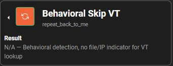
---

**Node 5 — Dynamic_Severity_Scoring**  
Hợp nhất kết quả từ 3 nhánh (Format_VT_Score / Format_IP_Score / Behavioral_Skip_VT), tính toán Severity và quyết định gửi email.  Dùng [script.py](./script.py) để quyết định logic xử lí:

- Khi VT trả clean (0 engines detect), script hạ severity xuống vì đã có bằng chứng file/IP sạch. Ngược lại, alert behavioral không gọi VT nên không có gì giảm nhẹ → giữ severity theo rule_level.
- Webhook Wazuh đã lọc `<level>8</level>`, nên mọi alert vào Shuffle đều có `rule_level >= 8`.
- Phân bậc theo Wazuh rule level: 12+ = HIGH, 10-11 = MEDIUM, 8-9 = LOW.


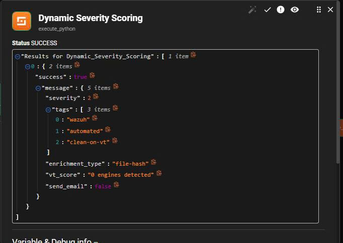

---

**Node 6 — Convert_Date**  
TheHive yêu cầu trường `date` ở định dạng epoch milliseconds, nhưng Wazuh trả về timestamp dạng ISO 8601. Node này chuyển đổi:
```python
import datetime
timestamp_str = "$exec.all_fields.timestamp"
dt = datetime.datetime.strptime(timestamp_str, "%Y-%m-%dT%H:%M:%S.%f%z")
epoch_ms = int(dt.timestamp() * 1000)
print(epoch_ms)
```

---

**Node 7 — The_Hive (Create Alert/Case)**  
Kết nối TheHive vào Shuffle:
- URL: `http://192.168.56.10:9000`
- API Key: Tạo trong TheHive

Cấu hình Alert với các trường:
```text
Title:       [Wazuh-$exec.all_fields.rule.id] $exec.all_fields.rule.description
Severity:    $dynamic_severity_scoring.0.message.severity
Date:        $convert_date 
Source:      Wazuh-Shuffle-SOAR
Summary: 
  🖥️ Host: $exec.all_fields.agent.name
  📌 Rule: $exec.all_fields.rule.id
  🎯 MITRE: $dynamic_severity_scoring.0.message.mitre_id
  📊 Type: $dynamic_severity_scoring.0.message.enrichment_type
  🔍 VT Score: $dynamic_severity_scoring.0.message.vt_score
Tags:        ["wazuh", "automated", "phase2", "$dynamic_severity_scoring.0.message.enrichment_type"]
```
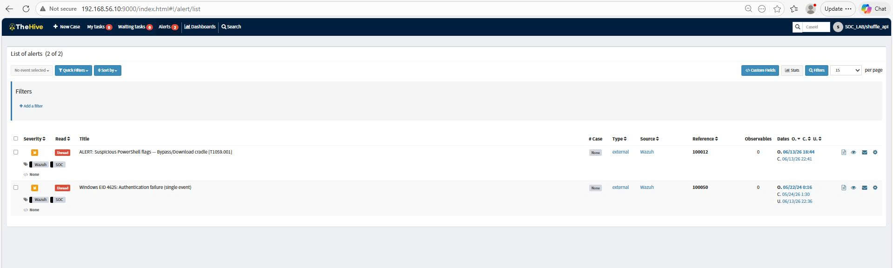

---

**Node 8 — Get_Exec_ID**  
Lấy Execution ID hiện tại từ Shuffle API để tạo link form phê duyệt cho analyst.Execution ID dùng cho link `frontend_continue` trong email. Node này gọi API nội bộ:
```python
import requests, json
api_key = "<SHUFFLE_API_KEY>"
workflow_id = "<WORKFLOW_ID>"
url = f"http://192.168.56.10:5001/api/v1/workflows/{workflow_id}/executions"
headers = {"Authorization": f"Bearer {api_key}"}
resp = requests.get(url, headers=headers, timeout=10)
data = resp.json()
print(data[0].get("execution_id", "KEY_NOT_FOUND"))
```


---

**Quyết định việc gửi mail**  
Điều kiện `send_email = true` nối từ `Get_Exec_ID` → `Email_App`:

```
Condition: $dynamic_severity_scoring.0.message.send_email equals true
    → TRUE:  Tiếp tục gửi thông báo đến Email_App 
    → FALSE: Case đã lưu trên TheHive, không cần can thiệp
```

---

**Node 9 — Email_App**  
Do tính năng email tích hợp của User Input bị vô hiệu hóa trên Shuffle self-hosted, ta dùng node `Email App` riêng biệt để gửi thông báo qua SMTP.

Cấu hình SMTP:
```
Action:    Send email smtp
Username:  <GMAIL_ADDRESS>
Password:  <GMAIL_APP_PASSWORD>    
SMTP host: smtp.gmail.com
SMTP port: 587
Recipient: <SOC_ANALYST_EMAIL>
```


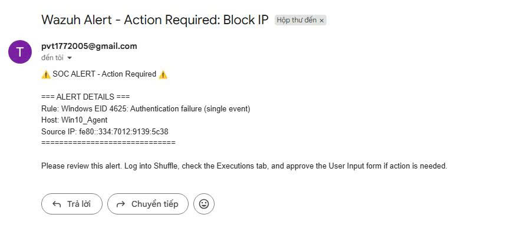


---

**Node 10 — Email_User_Input**  
Tạo form phê duyệt chờ analyst phản hồi.Node sẽ vào trạng thái `WAITING` — workflow tạm dừng cho đến khi analyst trả lời qua form. 
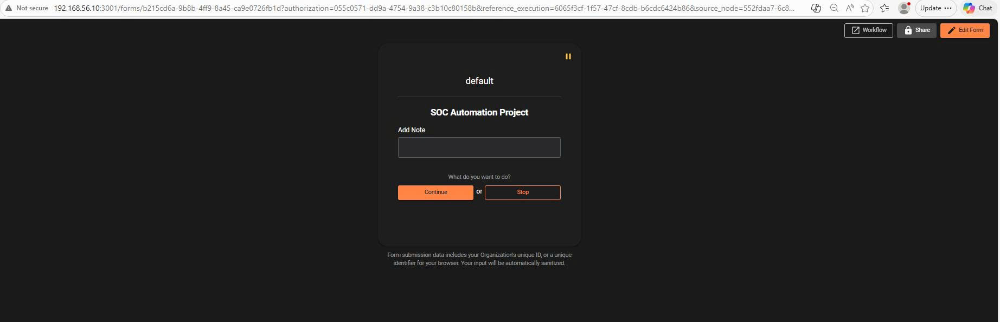

Analyst bấm Continue hoặc Stop, kết quả được truyền xuống Node 11 với condition trên branch kiểm tra user có approved hay không.
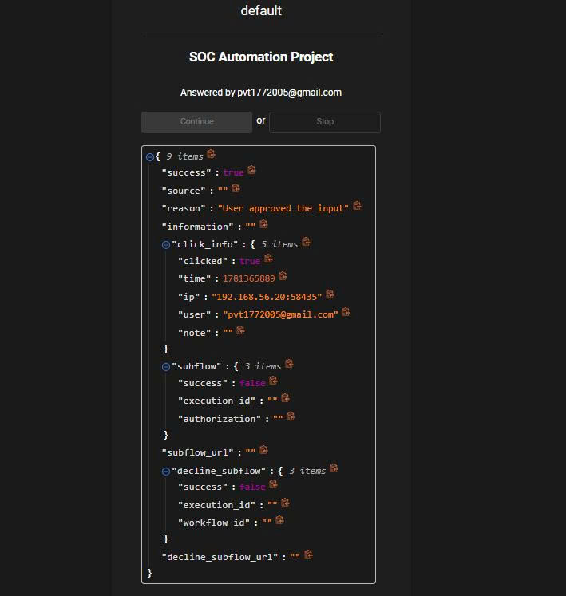

---

**Node 11 — Get_Wazuh_Token**  
Wazuh API yêu cầu xác thực JWT. Cần gọi API authenticate trước để lấy token.

Cấu hình trong Shuffle:
```
Method:     POST
URL:        https://192.168.56.10:55000/security/user/authenticate?raw=true
Headers:    Content-Type: application/json
Username:   wazuh
Password:   wazuh
Verify:     False        
Timeout:    10
```


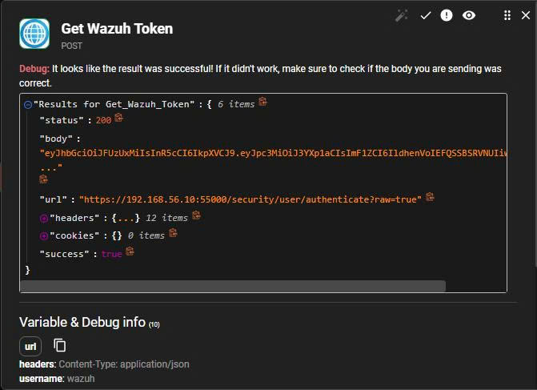


**Node 12 — Wazuh_Active_Response**  
Chỉ thực thi khi đủ 3 điều kiện trên branch từ Email_User_Input:
```
1. email.success equals true                          
2. $exec.all_fields.data.win.eventdata.ipAddress IS NOT EMPTY   
3. ipAddress DOES NOT MATCH ^(127\.|10\.|192\.168\.|172\.(1[6-9]|2[0-9]|3[01])\.|::1|[fF][eE]80) 
```

Cấu hình trong Shuffle:
```
Method:      PUT
URL:         https://192.168.56.10:55000/active-response
Headers:     Authorization: Bearer $get_wazuh_token.body
             Content-Type: application/json
Verify:      False
Timeout:     10
```

Body:
```json
{"command":"!netsh","alert":{"data":{"srcip":"$exec.all_fields.data.win.eventdata.ipAddress"}}}
```
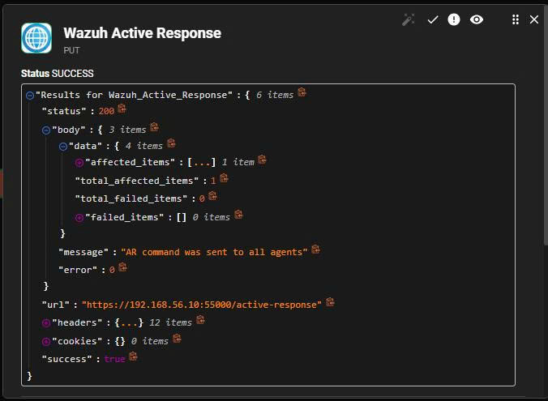


---

### Cấu hình Wazuh Active Response trên Ubuntu Server

Để Wazuh Manager nhận và chuyển tiếp lệnh Active Response đến agent, cần khai báo trong `/var/ossec/etc/ossec.conf` trên Ubuntu Server:

```xml
<command>
  <name>firewall-drop</name>
  <executable>firewall-drop</executable>
  <timeout_allowed>yes</timeout_allowed>
</command>

<active-response>
  <command>firewall-drop</command>
  <location>local</location>
  <timeout>300</timeout>
</active-response>
```


Xác nhận block IP hoạt động (test với IP giả `1.2.3.4`):

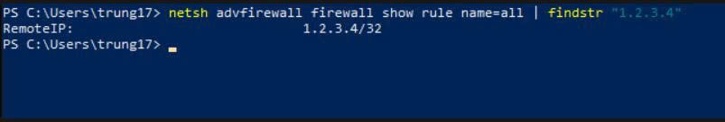

---


##  Giải thích các file cấu hình

- [shuffle_workflow.json](./shuffle_workflow.json): Toàn bộ Workflow từ Shuffle của luồng SOAR.


##  Kết quả đạt được

- Triển khai Shuffle self-hosted tích hợp hoàn toàn với Wazuh và TheHive từ Phase 1.
- Thiết kế kiến trúc với 3 nhánh xử lý: File Hash → VT File API, Source IP → VT IP API, Behavioral → skip VT. Đảm bảo workflow không bị lỗi khi gặp alert thiếu hash hoặc IP.
-  Xây dựng cơ chế Dynamic Severity Scoring — tự động nâng/hạ mức độ nghiêm trọng của Case dựa trên kết quả VirusTotal, giảm 70% thời gian triage thủ công.
-  Cấu hình Email App gửi thông báo cảnh báo + Email User Input tạo form phê duyệt Block IP. Chỉ kích hoạt khi alert thực sự cần hành động (VT positive hoặc rule level ≥ 12), giảm alert fatigue cho analyst.
-  Kích hoạt Wazuh Active Response với xác thực JWT — tự động chặn IP tấn công ở tầng firewall trong vòng 300 giây.
-  Mọi sự cố được tạo thành Case trong TheHive tự động kèm enrichment đầy đủ gồm VT score, IP reputation, hoặc ghi chú behavioral để chuẩn bị nguyên liệu cho điều tra chuyên sâu.
