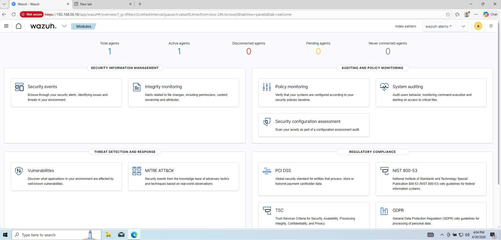

# 🛠️ Installing Wazuh Manager on Ubuntu Server

Quá trình này sẽ thiết lập "trái tim" của hệ thống SOC - nơi tiếp nhận, phân tích và hiển thị toàn bộ Telemetry từ các Endpoint. Việc cài đặt Native giúp tối ưu hóa tài nguyên phần cứng và quản lý sâu ở cấp độ hệ điều hành.

## 1. Cập nhật hệ thống

```bash
sudo apt update && sudo apt upgrade -y
```
## 2. Cài đặt Wazuh 
 ```bash 
curl -sO https://packages.wazuh.com/4.x/wazuh-install.sh
sudo bash ./wazuh-install.sh -a
```

 ## 3. Kiểm tra trạng thái dịch vụ
```bash
sudo systemctl status wazuh-manager
```
## 4. Truy cập giao diện quản trị
- Truy cập vào địa chỉ IP của Ubuntu Server: https://192.168.56.10
- Đăng nhập với tài khoản admin và mật khẩu đã tạo.

- Giao diện dashboard



## 5. Tối ưu cấu hình cảnh báo trên Wazuh Manager

Để tối ưu hóa dung lượng lưu trữ và giảm thiểu cảnh báo rác, chúng ta sẽ cấu hình Wazuh chỉ nhận và lưu trữ các log đã kích hoạt thành công rule, đồng thời tùy chỉnh mức độ cảnh báo hiển thị trên Dashboard.

### Tắt tính năng lưu trữ toàn bộ Log (Logall) và cấu hình Alert Level
Truy cập và chỉnh sửa file [/var/ossec/etc/ossec.conf](../Phase-1-Detection/wazuh_manager_ossec.conf). Đảm bảo rằng `<logall>` và `<logall_json>` được đặt thành `no`  để Wazuh không lưu trữ các log sự kiện thô không cần thiết.

Đồng thời, tìm đến thẻ `<alerts>` và thay đổi giá trị `<log_alert_level>` thành `5` (Mặc định là 3). Việc này giúp Dashboard của hệ thống chỉ ghi nhận và hiển thị các cảnh báo từ Level 5 trở lên:

### Cấu hình Filebeat chỉ đọc dữ liệu Alerts
Do chúng ta không lưu trữ toàn bộ log (Archive), cấu hình Filebeat cần được thiết lập chỉ đọc luồng dữ liệu Alerts, vô hiệu hóa việc đọc luồng Archives. 

Chỉnh sửa file cấu hình [/etc/filebeat/filebeat.yml](../Phase-1-Detection/wazuh_manager_filebeat.yml):


### Khởi động lại dịch vụ
Hệ thống cần được khởi động lại để áp dụng cấu hình vừa chỉnh sửa:

```bash
sudo systemctl restart wazuh-manager.service
sudo systemctl restart filebeat
```

