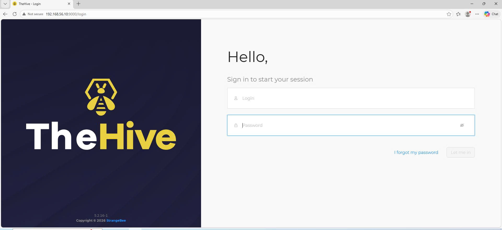
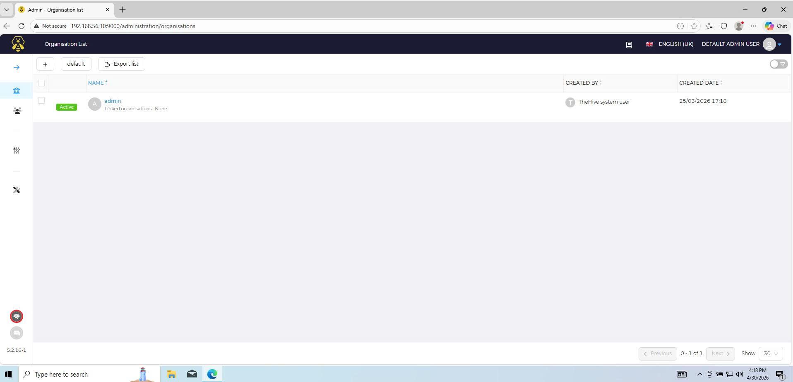

# Deploying TheHive with Docker

I used Docker to keep things clean and separated. TheHive, Cassandra, and Elasticsearch all run as containers.

## 1. Install Docker and Docker Compose
```bash
sudo apt install docker.io docker-compose -y
sudo systemctl enable --now docker
```
## 2. Create the docker-compose.yml
```bash
mkdir thehive && cd thehive
nano docker-compose.yml
```
See the full config here: [docker-compose.yml](../Phase-2-Automation/docker-compose.yml)

## 3. Start the Stack
```bash
sudo docker-compose up -d
sudo docker ps
```
## 4. Access TheHive
Open your browser and go to: http://192.168.56.10:9000



## 5. Configure TheHive, Cassandra and Elasticsearch

In this Docker setup, configs are mounted into the containers using `.yaml`/`.conf` files.

### Cassandra Config
Create the config directory and set up [cassandra.yaml](../Phase-2-Automation/cassandra.yaml) for cluster name and listen address.

```bash
mkdir -p ./cassandra_config
nano ./cassandra_config/cassandra.yaml
```


### Elasticsearch Config and RAM Limit
- For stable indexing in TheHive, create [elasticsearch.yml](../Phase-2-Automation/elasticsearch.yml) and set a RAM limit so it doesn't crash the server:
```bash
mkdir -p ./elasticsearch_config
mkdir -p ./elasticsearch_data ./cassandra_data
nano ./elasticsearch_config/elasticsearch.yml
```

- Then create [jvm.options](../Phase-2-Automation/jvm.options) to cap the JVM at 2GB RAM and fix the `log4j2` issue:
```bash
nano ./elasticsearch_config/jvm.options
```


### TheHive Config
- TheHive needs a secret key for session security and encryption.
- Run this command to generate a random string, then copy it:
```bash
cat /dev/urandom | tr -dc 'a-zA-Z0-9' | fold -w 64 | head -n 1
```

- Create the config directory and edit [application.conf](../Phase-2-Automation/application.conf):
```bash
mkdir -p ./thehive_config
nano ./thehive_config/application.conf
```


### Restart the Stack

Bring everything down and back up to apply the new configs:
```bash
sudo docker-compose down
sudo docker-compose up -d
```
